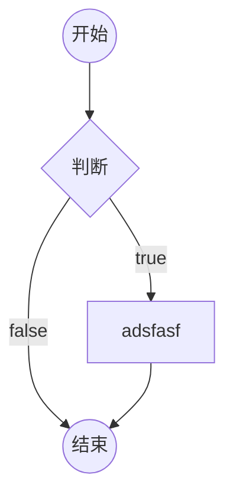
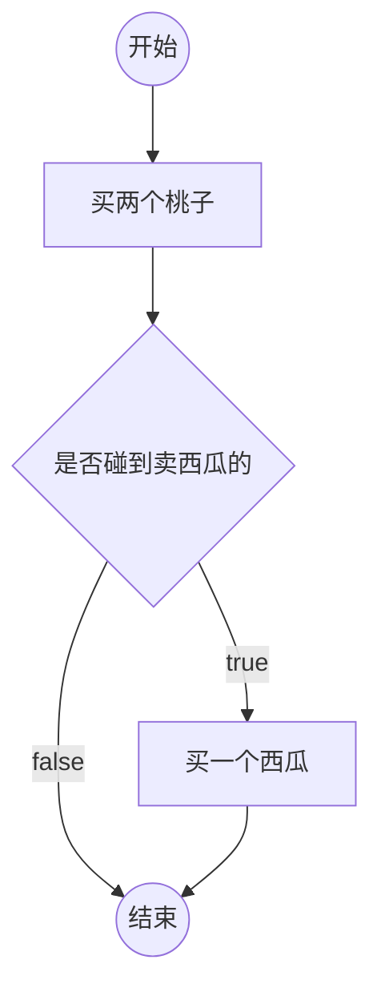
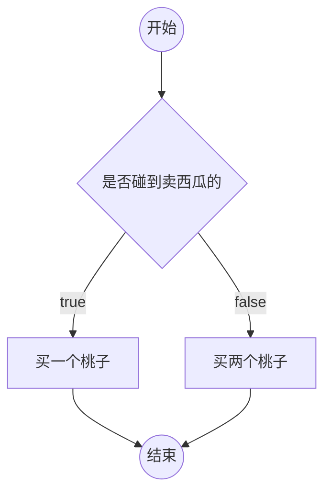
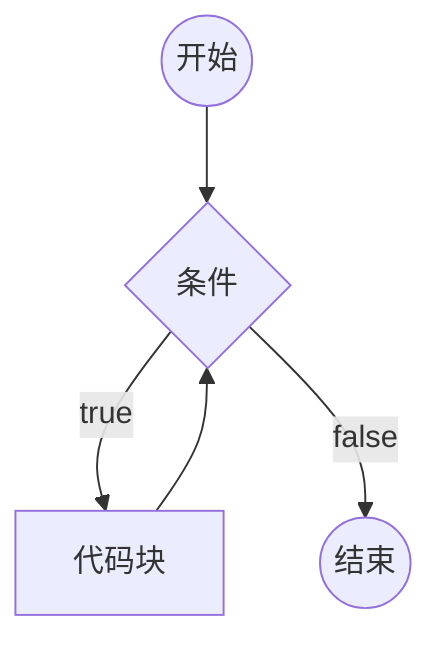
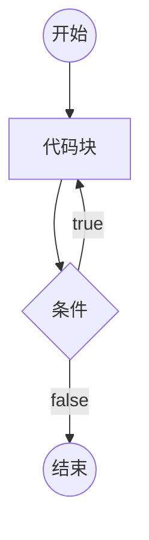
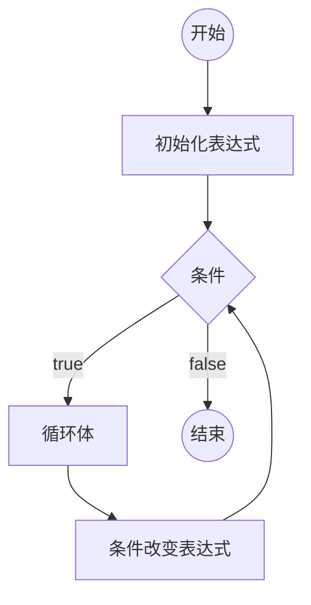

# 第一个 JS 程序

## 浏览器环境中，代码书写位置

1. 直接书写到页面中的 script 元素的内部
2. 书写到外部的 js 文件，在页面中引用 [推荐]
3. 书写在 HTML 文档中，[不推荐，尽量不要使用]

代码分离：内容、样式、功能，三者分离，更加容易维护和阅读

- 页面中，可以存在多个 script 元素，执行顺序从上到下
- 如果一个 script 元素引用了外部文件，内部不能书写任何代码
- script 元素有一个可选的属性，type，该属性用于指定代码的类型，该属性值是 MIME 格式

## 认识基本语法

- 语法部分必须都是英文符号
- js 代码由多条语句构成，每个语句用英文分号结束（并非强制要求，如果没有浏览器会自动添加，但有时候会造成不可预估的错误）
- js 代码从上到下同步执行（一条语句输出完之后在执行下一条语句）
- js 语言大小写敏感（严格区分大小写）

## 认识输出语句

所有的输出语句都不是 ES 标准。

- document.write，该语句用于将数据输出到页面
- alert，该语句用于将数据用弹窗的形式显示到页面
- console.log，该语句用于将数据显示到控制台

## 认识注释

注释：提供给代码阅读者使用，不会参与执行

1. 单行注释 //

2. 多行注释 /\* \*/

3. 文档注释
   /\*

   \*
   \*/
   在 VSCode 中，使用快捷键 ctrl + /，可以快速添加和取消单行注释
   使用快捷键 alt + shift + a，可以快速添加和取消多行注释

# 数据和数据类型

数据：有用的信息

数据类型：数据的分类

本节课学习的是：不同类型的数据的字面量表示法

## JS 中的数据类型

学习 JS 中，不同数据类型的数据的书写方式

### 原始类型(基本类型)

原始类型指不可再细分的类型

1. 数字类型 number

直接书写即可,包括正数,负数,小数
特例:NaN(not a number)不是一个有效的合法数字,但是类型为 Number

> 了解：
> 数字类型可以加上前缀，来表示不同的进制
> 0：表示 8 进制
> 0x：表示 16 进制
> 0b: 表示 2 进制

2. 字符串类型 string

字符串：一长串文本（0 个或多个）

- 单引号 '
- 双引号 "
- 飘，`，叫做模板字符串

在字符串中，如何表示一个特殊字符，可以使用转义符（\）

3. 布尔类型 boolean

布尔类型用于表达真或假两种状态

- true，表示真
- false，表示假

4. undefined 类型

表示未定义，不存在。

只有一种数据书写方式：undefined

5. null 类型

表示空，不存在。

除非自己书写属性为 null,否则该类型不会出现

只有一种数据书写方式：null

> 区分某些长数字和字符串: 如果按照数字的方式阅读，则使用数字类型；否则使用字符串类型

### 引用类型

引用类型有两种：

- 对象 object （事物，东西，玩意儿）

可以认为，对象，是由多个基本类型组合而成。

书写对象的格式

```js
console.log({
  name: "姬成",
  nickName: "成哥",
  age: 108,
  gender: true, //true表示男，false表示女
  address: {
    country: "中国",
    province: "黑龙江",
    city: "哈尔滨",
    detail: "那嘎达二街11号"
  },
  girlFriend: undefined
});
```

**属性**：对象的成员

- 函数（后续章节专门讲解）

## 得到数据的类型

在数据前加上 typeof
typeof 有两种书写格式：

1. typeof (数据)
2. typeof[空格]数据

> js 的 bug（特征）： typeof null，得到的是 object

## 字面量

直接书写的具体的数据，叫做**字面量**

# 变量

## 什么是变量

变量是一块内存空间，可以理解为是一个值的容器或代名词,用于保存数据

> 计算机：CPU、内存、硬盘、输入输出设备
> 内存：存取速度快，数据易丢失
> 硬盘：存取速度慢，数据永久保存
> 计算机程序的运行，仅与内存打交道

## 如何使用变量

1. 声明（定义）变量

```js
var 变量名;
```

**变量声明后未赋值，它的默认值为 undefined**

2. 给变量赋值

向变量的内存空间中存放数据

- 变量的值是可变的

变量可以被重新赋值，新的值会覆盖原来的值

- 变量的名称

在开发中，凡是需要自行命名的位置，叫做标识符

标识符的规范：

1. [必]只能以英文字母、下划线、\$开头
2. [必]其他位置可以出现数字、英文字母、下划线、\$
3. [必]不可以与关键字、保留词重复
4. [选]标识符应该做到望文知义
5. [选]如果有多个单词，使用驼峰命名法，单词首字母大写

> 关键字：官方已经使用的名字
> 保留字：官方将来可能使用的名字
> 大驼峰：每个单词首字母大写
> 小驼峰：除第一个单词外，首字母大写
> 目前，使用的标识符都是小驼峰命名法。

> 宽度：width，高度：height，区域：area （quyu）

- 声明和赋值合并

变量的声明和赋值可以一条语句书写。

这是语法糖。

语法糖仅仅是为了方便代码书写或记忆，并不会有实质性的改变。

- 多个变量可以合并声明并赋值
  多个变量之间用`js ,`隔开

```js
    var a = 1,
        b = 2,
        c = 3,
         ....
```

语法糖

- **任何可以书写数据的地方，都可以书写变量**
- 若使用一个未声明的变量，会导致错误

例外：使用 typeof 得到类型时，可以是未声明的变量，得到的结果是 undefined

- **JS 中存在变量提升**

所有变量的声明，会自动的提到代码的最顶部

但是，这种提升，不会超越脚本块。

- JS 中允许定义多个同名变量

同名变量，提升后会变成一个。

## 作业

定义三个变量，分别保存用户姓名、用户年龄、用户是否是 vip，然后输出它们。

# 变量和对象

原始类型：number、string、boolean、null、undefined

引用类型：object、function 函数

## 在变量中存放对象

1. 通过变量，读取对象中的某个属性

```js
变量名.属性名;
```

**当读取的属性不存在时，会得到 undefined**

**当读取属性的对象不存在（undefined 或 null）时，程序报错**

2. 通过变量，更改对象中的某个属性

**当赋值的属性不存在时，会添加属性**

3. 删除属性

```js
delete 变量名.属性名;
无法删除变量，函数
只能删除引用类型的属性，数据只会删除数组项，下标不会改变
```

4. 属性表达式

给属性赋值，或读取属性时，可以使用下面的格式操作

```js
对象变量["属性名"];
```

- 某些属性名中包含特殊字符

实际上，JS 对属性名的命名要求并不严格，属性可以是任何形式的名字

**属性的名字只能是字符串，如果你书写的是数字，会自动转换为字符串**

## 全局对象

JS 大部分的宿主环境，都会提供一个特殊的对象，该对象可以直接在 JS 代码中访问，该对象叫做全局对象

在浏览器环境中，全局对象为 window，表示整个窗口

全局对象中的所有属性，可以直接使用，而不需要写上全局对象名。

**开发者定义的所有变量，实际上，会成为 window 对象的属性。**

**如果变量没有被赋值，则该变量不会覆盖 window 对象上的同名属性。**

# 引用类型

原始类型 引用类型（对象、函数）

**原始类型的变量，存放的具体的值**

**引用类型的变量，存放的是内存地址**

**凡是出现对象字面量的位置，都一定在内存出现一个新的对象**

> 扩展知识：JS 中的垃圾回收
> 垃圾回收器，会定期的发现内存中无法访问到的对象，该对象称之为垃圾，垃圾回收器会在合适的时间将其占用的内存释放。

# 运算符概述

第 2 章：变量和数据类型，解决数据存放问题
第 3 章：运算符，解决数据运算的问题，面试题密集

## 操作符和操作数

操作符：运算符，参与运算的符号

操作数：参与运算的数据，也称之为“元”

操作符不一定只有一个符号

操作符出现在不同的位置，可能具有不同的含义

```js
1 - 2;
-1.2;
```

目前接触的操作符：

1. `=`：赋值符号，将右边的数据赋值给左边
2. `.`: 访问符号，用于访问对象的属性
3. `[]`：访问符号，用于访问对象的属性
4. `()`：函数调用

## 分类

按操作数数量区分：

1. 一元（目）运算符：() . []
2. 二元（目）运算符: + - / \* % =
3. 三元（目）运算符: ?:

功能区分：

1. 算术运算符（数学）
2. 比较运算符
3. 逻辑运算符
4. 位运算符
5. 其他

## 表达式

表达式 = 操作符 + 操作数

每个表达式都有一个运算结果，该结果叫做**返回值**，返回值的类型叫做**返回类型**

所有的表达式都可以当作数据使用。

目前学习的运算符的返回值和类型

1. `=`：该表达式，返回赋值的结果
2. `.`：属性访问表达式，返回的是属性的值
3. `[]`：属性访问表达式，返回的是属性的值
4. `()`：函数调用表达式，返回的结果取决于函数的运行
5. 如果是一个声明+赋值的表达式，返回结果为 undefined。

console.log 函数调用的返回结果为 undefined

> chrome 浏览器控制台的环境是 REPL 环境
> REPL：Read Eval Print Loop，读-执行-打印-循环
> 当直接在控制台书写代码时，除了运行代码之外，还会输出该表达式的返回值

# 算术运算符

数学运算符

1. `+ - * /`
2. `+ -`
3. `%`
4. `++ --` (下节课讨论)
5. `**` 幂

## 细节

1. 数字运算是不精确的
2. 除数为 0

如果被除数是正数，得到结果 Infinity （正无穷）
如果被除数是负数，得到结果 -Infinity （负无穷）
如果被除数是 0，得到结果 NaN （Not a Number，非数字）

> typeof 函数返回类型为 string
> isNaN 函数，该函数用于判断一个数据是否是 NaN，返回 boolean
> isFinite 函数，该函数用于判断一个数据是否是有限的，返回 boolean

3. 求余

%，有的教程称之为求模

余数的符号，与被除数相同。

## 其他类型使用算术运算

1. 除加号之外的算术运算符

将原始类型转换为数字类型（自动完成转换），然后进行运算。

- boolean： true -> 1, false -> 0

- string: 如果字符串内部是一个正确的数字，直接变为数字，如果是一个非数字，则得到 NaN（能识别 Infinity，不能把字符串内部的东西当作表达式），如果字符串是一个空字符串（没有任何内容），转换为 0. 字符串转换时，会忽略前后空格。

  > NaN 虽然是数字，但它和任何数字作任何运算，得到的结果都是 NaN

- null：null -> 0

- undefined: undefined -> NaN

将对象类型先转换为字符串类型，然后再将该字符串转换为数字类型

对象类型 -> "[object Object]" -> NaN

2. 加号运算符

- 加号一边有字符串，含义变为字符串拼接

将另一边的其他类型，转换为字符串

数字 -> 数字字符串
boolean -> boolean 字符串
null -> "null"
undefined -> "undefined"
对象 -> "[object Object]"

- 加号两边都没有字符串，但一边有对象，将对象转换为字符串，然后按照上面的规则进行
- 其他情况和上面的数学运算一致

## 作业

1. 温度转换器

设置一个变量，保存摄氏温度（C），将其转换为华氏温度（F）

F = (9/5)C + 32

2. 利息计算器

设置变量，分别存放本金、月数、年利率，计算利息

# 自增和自减

## 基本功能

一元运算符

++：将某个变量的值自增 1

--：将某个变量的值自减 1

## 细节

### 自增自减表达式

x++: 将变量 x 自增 1，得到的表达式的值是自增之前的值。
++x: 将变量 x 自增 1，得到的表达式的值是自增之后的值。
x--: 将变量 x 自减 1，得到的表达式的值是自减之前的值。
--x: 将变量 x 自减 1，得到的表达式的值是自减之后的值。

### 优先级

从高到底依次是：

1. `++ --`
2. `* / %`
3. `+ -`

优先级的运算细节：

1. 从左到右依次查看
2. 如果遇到操作数，将数据的值直接取出
3. 如果遇到相邻的两个运算符，并且左边的运算符优先级大于等于右边的运算符，则直接运行左边的运算符。

# 比较运算符

大小比较：> < >= <=
相等比较：== != === !==

**比较运算符的返回类型：boolean**

**算术运算符的优先级高于比较运算符**

## 大小比较

### 细节

1. 两个字符串比较大小，比较的是字符串的字符编码。
2. 如果一个不是字符串，并且两个都是原始类型，将它们都转换为数字进行比较

'1' -> 1
'' -> 0
' ' -> 0
' a' -> NaN
'3.14' -> 3.14

NaN 与任何数字比较，得到的结果都是 false

Infinity 比任何数字都大

-Infinity 比任何数字都小

3. 如果其中一个是对象，将对象转换为原始类型然后，按照规则 1 或规则 2 进行比较

目前，对象转换为原始类型后，是字符串 "[object Object]"

## 相等比较

### == 和 != (相等比较 和 不相等比较)

==: 比较两个数据是否相等
!=: 比较两个数据是否不相等

**细节**

1. 两端的类型相同，直接比较两个数据本身是否相同（两个对象比较的地址）
2. 两端的类型不同

1). null 和 undefined， 它们之间相等， 和其他原始类型比较， 则不相等。
2). 其他原始类型，比较时先转换为数字，再进行比较
3). NaN 与任何数字比较，都是 false，包括自身
4). Infinity 和-Infinity，自能和自身相等
5). 对象比较时，要先转换为原始类型后，再进行比较

**由于相等和不相等比较，对于不同类型的数据比较违反直觉，因此，通常我们不适用这种比较方式，而是使用更加接近直觉的严格相等和严格不相等比较**

### === 和 !== （严格相等 和 严格不相等）

=== ： 两端的数据和类型必须相同
!== ： 两端的数据或类型不相同

1. 两端类型相同，规则和相等比较一致。
2. 两端类型不同，为 false。

数字规则：

1). NaN 与任何数字比较，都是 false，包括自身
2). Infinity 和-Infinity，自能和自身相等

# 逻辑运算符

布尔运算符

## 与（并且）

符号：&&

书写方式： 表达式 1 && 表达式 2

1. 将表达式 1 进行 boolean 判定

以下数据均判定为 false：

1. null
2. undefined
3. false
4. NaN
5. ''
6. 0

其他数据全部为真

2. 如果表达式 1 的判定结果为假，则直接返回表达式 1，而不执行表达式 2；否则，返回表达式 2 的结果。 （短路规则）

## 或

符号：||

写法：表达式 1 || 表达式 2

1. 将表达式 1 进行 boolean 判定
2. 如果表达式 1 为真，直接返回表达式 1，不运行表达式 2；否则，返回表达式 2

## 非

符号：!

写法: !数据

一元运算符

将数据的 boolean 判定结果直接取反，非运算符一定返回 boolean 类型。

## 作业

1. 用一个变量保存成绩，输出该成绩是否及格（true 或 false）
2. 用一个变量保存年份，得到该年份 2 月的天数
3. 利息计算器

设置变量，分别存放本金、月数、年利率，计算利息

如果本金存放量超过了 10 万，年利率上浮 20%（比如，年利率为 4%，上浮后的年利率 4% \* 1.2）

# 三目运算符

书写方式： 表达式 1 ? 表达式 2 : 表达式 3

1. 对表达式 1 进行 boolean 判定
2. 如果判定结果为真，返回表达式 2；否则，返回表达式 3。

# 补充知识

## 模板字符串

## 类型转换不会影响原本的数据

## 复合的赋值运算符

+= -= /= \*= %= \*\*=

## void 运算符

一元运算符

写法：

1. 普通写法： `void 表达式`
2. 函数写法： `void(表达式)`

运行表达式，然后返回 undefined

## typeof 运算符

一元运算符

写法：

1. 普通写法： `typeof 表达式`
2. 函数写法： `typeof(表达式)`

typeof 运算，返回表达式的类型，是一个字符串。

## 逗号运算符

写法：表达式 1, 表达式 2

依次运行两个表达式，返回表达式 2

逗号运算符的优先级比赋值更低

# 数据和数据类型

数据：有用的信息

数据类型：数据的分类

本节课学习的是：不同类型的数据的字面量表示法

## JS 中的数据类型

学习 JS 中，不同数据类型的数据的书写方式

### 原始类型(基本类型)

原始类型指不可再细分的类型

1. 数字类型 number

直接书写即可

> 了解：
> 数字类型可以加上前缀，来表示不同的进制
> 0：表示 8 进制
> 0x：表示 16 进制
> 0b: 表示 2 进制

2. 字符串类型 string

字符串：一长串文本（0 个或多个）

- 单引号 '
- 双引号 "
- 飘，`，叫做模板字符串

在字符串中，如何表示一个特殊字符，可以使用转义符（\）

3. 布尔类型 boolean

布尔类型用于表达真或假两种状态

- true，表示真
- false，表示假

4. undefined 类型

表示未定义，不存在。

只有一种数据书写方式：undefined

5. null 类型

表示空，不存在。

只有一种数据书写方式：null

> 区分某些长数字和字符串: 如果按照数字的方式阅读，则使用数字类型；否则使用字符串类型

### 引用类型

引用类型有两种：

- 对象 object （事物，东西，玩意儿）

可以认为，对象，是由多个基本类型组合而成。

书写对象的格式见 test6.html

**属性**：对象的成员

- 函数（后续章节专门讲解）

## 得到数据的类型

在数据前加上 typeof

> js 的 bug（特征）： typeof null，得到的是 object

## 字面量

直接书写的具体的数据，叫做**字面量**

## 作业

将自己作为一个对象，书写合适的对象属性，输出该对象。

# 变量

## 什么是变量

变量是一块内存空间，用于保存数据

> 计算机：CPU、内存、硬盘、输入输出设备
> 内存：存取速度快，数据易丢失
> 硬盘：存取速度慢，数据永久保存
> 计算机程序的运行，仅与内存打交道

## 如何使用变量

1. 声明（定义）变量

```js
var 变量名;
```

**变量声明后，它的值为 undefined**

2. 给变量赋值

向变量的内存空间中存放数据

- 变量的值是可变的

变量可以被重新赋值，新的值会覆盖原来的值

- 变量的名称

在开发中，凡是需要自行命名的位置，叫做标识符

标识符的规范：

1） [必]只能以英文字母、下划线、\$开头

2.  [必]其他位置可以出现数字、英文字母、下划线、\$
3.  [必]不可以与关键字、保留词重复
4.  [选]标识符应该做到望文知义
5.  [选]如果有多个单词，使用驼峰命名法，单词首字母大写

> 大驼峰：每个单词首字母大写
> 小驼峰：除第一个单词外，首字母大写
> 目前，使用的标识符都是小驼峰命名法。

> 宽度：width，高度：height，区域：area （quyu）

- 声明和赋值合并

变量的声明和赋值可以一条语句书写。

这是语法糖。

语法糖仅仅是为了方便代码书写或记忆，并不会有实质性的改变。

- 多个变量可以合并声明并赋值

语法糖

- **任何可以书写数据的地方，都可以书写变量**
- 若使用一个未声明的变量，会导致错误

例外：使用 typeof 得到类型时，可以是未声明的变量，得到的结果是 undefined

- **JS 中存在变量提升**

所有变量的声明，会自动的提到代码的最顶部

但是，这种提升，不会超越脚本块。

- JS 中允许定义多个同名变量

同名变量，提升后会变成一个。

## 作业

定义三个变量，分别保存用户姓名、用户年龄、用户是否是 vip，然后输出它们。

# 变量和对象

原始类型：number、string、boolean、null、undefined

引用类型：object、function 函数

## 在变量中存放对象

1. 通过变量，读取对象中的某个属性

```js
变量名.属性名;
```

**当读取的属性不存在时，会得到 undefined**

**当读取属性的对象不存在（undefined 或 null）时，程序报错**

2. 通过变量，更改对象中的某个属性

**当赋值的属性不存在时，会添加属性**

3. 删除属性

```js
delete 变量名.属性名;
```

4. 属性表达式

给属性赋值，或读取属性时，可以使用下面的格式操作

```js
对象变量["属性名"];
```

- 某些属性名中包含特殊字符

实际上，JS 对属性名的命名要求并不严格，属性可以是任何形式的名字

**属性的名字只能是字符串，如果你书写的是数字，会自动转换为字符串**

## 全局对象

JS 大部分的宿主环境，都会提供一个特殊的对象，该对象可以直接在 JS 代码中访问，该对象叫做全局对象

在浏览器环境中，全局对象为 window，表示整个窗口

全局对象中的所有属性，可以直接使用，而不需要写上全局对象名。

**开发者定义的所有变量，实际上，会成为 window 对象的属性。**

**如果变量没有被赋值，则该变量不会覆盖 window 对象上的同名属性。**

# 引用类型

原始类型 引用类型（对象、函数）

**原始类型的变量，存放的具体的值**

**引用类型的变量，存放的是内存地址**

**凡是出现对象字面量的位置，都一定在内存出现一个新的对象**

> 扩展知识：JS 中的垃圾回收
> 垃圾回收器，会定期的发现内存中无法访问到的对象，该对象称之为垃圾，垃圾回收器会在合适的时间将其占用的内存释放。

# 运算符概述

第 2 章：变量和数据类型，解决数据存放问题
第 3 章：运算符，解决数据运算的问题，面试题密集

## 操作符和操作数

操作符：运算符，参与运算的符号

操作数：参与运算的数据，也称之为“元”

操作符不一定只有一个符号

操作符出现在不同的位置，可能具有不同的含义

```js
1 - 2;
-1.2;
```

目前接触的操作符：

1. `=`：赋值符号，将右边的数据赋值给左边
2. `.`: 访问符号，用于访问对象的属性
3. `[]`：访问符号，用于访问对象的属性
4. `()`：函数调用

## 分类

按操作数数量区分：

1. 一元（目）运算符：() . []
2. 二元（目）运算符: + - / \* % =
3. 三元（目）运算符: ?:

功能区分：

1. 算术运算符（数学）
2. 比较运算符
3. 逻辑运算符
4. 位运算符
5. 其他

## 表达式

表达式 = 操作符 + 操作数

每个表达式都有一个运算结果，该结果叫做**返回值**，返回值的类型叫做**返回类型**

所有的表达式都可以当作数据使用。

目前学习的运算符的返回值和类型

1. `=`：该表达式，返回赋值的结果
2. `.`：属性访问表达式，返回的是属性的值
3. `[]`：属性访问表达式，返回的是属性的值
4. `()`：函数调用表达式，返回的结果取决于函数的运行
5. 如果是一个声明+赋值的表达式，返回结果为 undefined。

console.log 函数调用的返回结果为 undefined

> chrome 浏览器控制台的环境是 REPL 环境
> REPL：Read Eval Print Loop，读-执行-打印-循环
> 当直接在控制台书写代码时，除了运行代码之外，还会输出该表达式的返回值

# 算术运算符

数学运算符

1. `+ - * /`
2. `+ -`
3. `%`
4. `++ --` (下节课讨论)
5. `**` 幂

## 细节

1. 数字运算是不精确的
2. 除数为 0

如果被除数是正数，得到结果 Infinity （正无穷）
如果被除数是负数，得到结果 -Infinity （负无穷）
如果被除数是 0，得到结果 NaN （Not a Number，非数字）

> typeof 函数返回类型为 string
> isNaN 函数，该函数用于判断一个数据是否是 NaN，返回 boolean
> isFinite 函数，该函数用于判断一个数据是否是有限的，返回 boolean

3. 求余

%，有的教程称之为求模

余数的符号，与被除数相同。

## 其他类型使用算术运算

1. 除加号之外的算术运算符

将原始类型转换为数字类型（自动完成转换），然后进行运算。

- boolean： true -> 1, false -> 0
- string: 如果字符串内部是一个正确的数字，直接变为数字，如果是一个非数字，则得到 NaN（能识别 Infinity，不能把字符串内部的东西当作表达式），如果字符串是一个空字符串（没有任何内容），转换为 0. 字符串转换时，会忽略前后空格。

> NaN 虽然是数字，但它和任何数字作任何运算，得到的结果都是 NaN

- null：null -> 0
- undefined: undefined -> NaN

将对象类型先转换为字符串类型，然后再将该字符串转换为数字类型

对象类型 -> "[object Object]" -> NaN

2. 加号运算符

- 加号一边有字符串，含义变为字符串拼接

将另一边的其他类型，转换为字符串

数字 -> 数字字符串
boolean -> boolean 字符串
null -> "null"
undefined -> "undefined"
对象 -> "[object Object]"

- 加号两边都没有字符串，但一边有对象，将对象转换为字符串，然后按照上面的规则进行
- 其他情况和上面的数学运算一致

## 作业

1. 温度转换器

设置一个变量，保存摄氏温度（C），将其转换为华氏温度（F）

F = (9/5)C + 32

2. 利息计算器

设置变量，分别存放本金、月数、年利率，计算利息

# 自增和自减

## 基本功能

一元运算符

++：将某个变量的值自增 1

--：将某个变量的值自减 1

## 细节

### 自增自减表达式

x++: 将变量 x 自增 1，得到的表达式的值是自增之前的值。
++x: 将变量 x 自增 1，得到的表达式的值是自增之后的值。
x--: 将变量 x 自减 1，得到的表达式的值是自减之前的值。
--x: 将变量 x 自减 1，得到的表达式的值是自减之后的值。

### 优先级

从高到底依次是：

1. `++ --`
2. `* / %`
3. `+ -`

优先级的运算细节：

1. 从左到右依次查看
2. 如果遇到操作数，将数据的值直接取出
3. 如果遇到相邻的两个运算符，并且左边的运算符优先级大于等于右边的运算符，则直接运行左边的运算符。

# 比较运算符

大小比较：> < >= <=
相等比较：== != === !==

**比较运算符的返回类型：boolean**

**算术运算符的优先级高于比较运算符**

## 大小比较

### 细节

1. 两个字符串比较大小，比较的是字符串的字符编码。
2. 如果一个不是字符串，并且两个都是原始类型，将它们都转换为数字进行比较

'1' -> 1
'' -> 0
' ' -> 0
' a' -> NaN
'3.14' -> 3.14

NaN 与任何数字比较，得到的结果都是 false

Infinity 比任何数字都大

-Infinity 比任何数字都小

3. 如果其中一个是对象，将对象转换为原始类型然后，按照规则 1 或规则 2 进行比较

目前，对象转换为原始类型后，是字符串 "[object Object]"

## 相等比较

### == 和 != (相等比较 和 不相等比较)

==: 比较两个数据是否相等
!=: 比较两个数据是否不相等

**细节**

1. 两端的类型相同，直接比较两个数据本身是否相同（两个对象比较的地址）
2. 两端的类型不同

1). null 和 undefined， 它们之间相等， 和其他原始类型比较， 则不相等。
2). 其他原始类型，比较时先转换为数字，再进行比较
3). NaN 与任何数字比较，都是 false，包括自身
4). Infinity 和-Infinity，自能和自身相等
5). 对象比较时，要先转换为原始类型后，再进行比较

**由于相等和不相等比较，对于不同类型的数据比较违反直觉，因此，通常我们不适用这种比较方式，而是使用更加接近直觉的严格相等和严格不相等比较**

### === 和 !== （严格相等 和 严格不相等）

=== ： 两端的数据和类型必须相同
!== ： 两端的数据或类型不相同

1. 两端类型相同，规则和相等比较一致。
2. 两端类型不同，为 false。

数字规则：

1). NaN 与任何数字比较，都是 false，包括自身
2). Infinity 和-Infinity，自能和自身相等

# 逻辑运算符

布尔运算符

## 与（并且）

符号：&&

书写方式： 表达式 1 && 表达式 2

1. 将表达式 1 进行 boolean 判定

以下数据均判定为 false：

1. null
2. undefined
3. false
4. NaN
5. ''
6. 0

其他数据全部为真

2. 如果表达式 1 的判定结果为假，则直接返回表达式 1，而不执行表达式 2；否则，返回表达式 2 的结果。 （短路规则）

## 或

符号：||

写法：表达式 1 || 表达式 2

1. 将表达式 1 进行 boolean 判定
2. 如果表达式 1 为真，直接返回表达式 1，不运行表达式 2；否则，返回表达式 2

## 非

符号：!

写法: !数据

一元运算符

将数据的 boolean 判定结果直接取反，非运算符一定返回 boolean 类型。

## 作业

1. 用一个变量保存成绩，输出该成绩是否及格（true 或 false）
2. 用一个变量保存年份，得到该年份 2 月的天数
3. 利息计算器

设置变量，分别存放本金、月数、年利率，计算利息

如果本金存放量超过了 10 万，年利率上浮 20%（比如，年利率为 4%，上浮后的年利率 4% \* 1.2）

# 三目运算符

书写方式： 表达式 1 ? 表达式 2 : 表达式 3

1. 对表达式 1 进行 boolean 判定
2. 如果判定结果为真，返回表达式 2；否则，返回表达式 3。

# 补充知识

## 模板字符串

## 类型转换不会影响原本的数据

## 复合的赋值运算符

+= -= /= \*= %= \*\*=

## void 运算符

一元运算符

写法：

1. 普通写法： `void 表达式`
2. 函数写法： `void(表达式)`

运行表达式，然后返回 undefined

## typeof 运算符

一元运算符

写法：

1. 普通写法： `typeof 表达式`
2. 函数写法： `typeof(表达式)`

typeof 运算，返回表达式的类型，是一个字符串。

## 逗号运算符

写法：表达式 1, 表达式 2

依次运行两个表达式，返回表达式 2

逗号运算符的优先级比赋值更低

# 流程图

一套的标准的图形，用于描述程序的逻辑

通常流程图分析程序的流程


> markdown 中粘贴图片，ctrl + alt + v

## 在 markdown 中画流程图



## 例子

邓哥的思维：



成哥的思维：



# if 判断

```js
if (条件1) {
  // 代码块
} else if (条件2) {
  // 代码块
} else if (条件3) {
  // 代码块
}
//....
else {
  // 以上条件都不满足执行的代码块
}
```

1. 如果某个条件满足，则直接忽略后面的所有条件
2. else if 可以有多个（包含 0 个）
3. else 可以有 1 个或 0 个
4. else 可以换行，可以不换行
5. 如果代码块只有一条语句，可以省略花括号（不推荐）
6. if 只能出现一次

## 补充

1. 用户输入: prompt("提示文本")

该表达式返回结果：

1. null：表示用户点击了取消
2. 用户输入的字符串：表示用户点击了确定，得到用户输入的结果

返回类型：null 或 字符串

2. 将字符串转换成数字：+字符串
3. 得到一个随机数

Math.random() 该表达式返回一个 0~1 之间的随机数字（无法取到 1）

# switch 开关

switch 的语法始终可以使用 if 结构替代。

```js
switch (表达式) {
  case 数据1:
    代码块;
  case 数据2:
    代码块;
  //...
  default:
    代码块;
}
```

1. 计算表达式的返回值，依次和 case 后面的数据进行严格相等的比较，如果某个相等，停止比较，然后运行其内部的代码块，再然后，依次运行之后的所有代码块。
2. 在 case 分支内部，使用 break 语句，可以立即停止 switch 结构。
3. default 表示前面的所有 case 都不匹配时运行。可以省略

# 循环

重复的运行一段代码

JS 支持 3 种循环结构：while 循环、do-while 循环、for 循环

## while 循环

```js
while(条件){
    代码块（循环体）
}
```



死循环：条件永远满足，永远无法退出循环。

## do-while 循环

```js
do {
  循环体;
} while (条件);
```



## for 循环

```js
for (初始化表达式; 条件; 条件改变表达式) {
  循环体;
}
```



## 循环中的关键字

循环控制语句

- break; 跳出循环
- continue; 停止当前循环体，进入下一次循环。

# 数组

数组用于存放多个数据

## 创建一个数组

1. new Array(长度)

长度，数组里面的数据总数，长度一定是一个非负整数

new Array(数据, 数据, 数据....)

创建一个数组，并初始化其每一项的值

数组项：数组其中的一项数据

2. [数据,数据,数据,....]

创建一个数据，并初始化其每一项的值

## 认识数组的本质

数组的本质是一个对象

- length 属性：数组的长度，会自动变化，值为最大下标+1
- 数字字符串属性：叫做下标，也叫做索引，相当于数组中每个数据的编号，下标从 0 开始排列

连续下标的取值范围：0 ~ length -1，如果给 length 直接赋值，会导致数组可能被截断

实际开发中，不要给 length 赋值。

## 下标

通常情况下，下标是连续的。

下标不连续的数组，叫做稀松数组。

## 数组的常见操作

### 添加数组项

- 数组[长度] = 数据：向数组末尾添加一个数据
- 数组.push(数据): 向数组末尾添加一个数据
- 数组.unshift(数据)：向数组起始位置添加一个数据，会导致数组每一项的下标向后移动
- 数组.splice(下标, 0, 添加的数据): 从指定下标位置开始，删除 0 个，然后在该位置插入添加的数据，如果下标超过范围，则按照范围的边界进行处理。

push、unshift、splice 可以添加多个数据

### 删除数据

- delete 数组[下标]: 这种做法不会导致数组其他的属性发生变化，因此，该做法会导致产生稀松数组，所以不推荐使用该做法。
- 数组.pop(): 删除数组的最后一项，该表达式返回最后一项的数据
- 数组.shift()：删除数组第一项，该表达式返回第一项的数据
- 数组.splice(下标, 删除的数量, 添加的数据): 从指定下标位置开始，删除指定数量，然后在该位置插入添加的数据，如果下标超过范围，则按照范围的边界进行处理。返回一个新数组，该数组记录被删除的数据。

### 其他操作

- 数组.slice(起始位置下标, 结束位置下标)：将起始位置到结束位置之间的数据拿出来，得到一个新的数组，该函数不会改变原数组；注意：结束下标取不到

下标可以写负数，如果是负数，则从数组的末尾开始计算。

如果不写结束下标，则直接取到末尾。

- 数组清空

数组.splice(0, 数组.length);

数组.length = 0;

- 查找数组中某一项的下标

数组.indexOf(数据)

从数组中依次查找对应的数据，查找时使用严格相等进行比较。找到第一个匹配的下标，返回。如果没有找到，则得到-1；

数组.lastIndexOf(数据)

功能和 indexOf 类似，只是查找的是最后一个匹配的下标

- 数组.fill

数组.fill(数据)：将数组的所有项，填充为指定的数据

数组.fill(数组, 开始下标): 将数组从开始下标起，到数组的末尾，填充为指定的数据

数组.fill(数组, 开始下标，结束下标): 将数组从开始下标起，到数组的结束下标（取不到），填充为指定的数据

## 语法补充

### in 关键字

判断某个属性在对象中是否存在

属性名 in 对象

### for-in foreach 循环

```js
for (var prop in 对象) {
  //循环体
}
```

取出对象的所有属性名，每次循环将其中一个属性名赋值给变量 prop，运行循环体。

# 函数语法

重复代码：让程序难以维护

函数主要用于减少重复代码

## 创建（定义、声明）函数

```js
function 函数名() {
  // 函数体
}
```

函数体的代码不会直接运行，必须要手动调用函数，才能运行其中的代码。

## 调用函数

运行函数体

```js
函数名();
```

## 函数提升

通过字面量声明的函数，会提升到脚本块的顶部。

通过字面量声明的函数，会成为全局对象的属性。

## 其他特点

通过 typeof 函数名，得到的结果是"function"

函数内部声明的变量：

1. 如果不使用 var 声明，和全局变量一致，表示给全局对象添加属性
2. 如果使用 var 声明，变量提升到所在函数的顶部，函数外部不可以使用该变量

**函数中声明的变量，仅能在函数中使用，在外部无效**

## 参数

参数表示函数运行的未知条件，需要调用者告知的数据

```js
// 参数的有效返回在函数体中
function 函数名(形参1, 形参2, ...){

}

函数名(实参)

```

如果实参没有传递，则对应的形参为 undefined

## 返回值

函数运行后，得到的结果，调用函数时，调用表达式的值就是函数的返回值

return 会直接结束整个函数的运行

return 后面如果不跟任何数据，返回 undefined

如果函数中没有书写 return，则该函数会在末尾自动 return undefined。

## 文档注释

```js
/**
 *
 *
 */
```

# 作用域和闭包

## 作用域

作用域表示一个代码区域，也表示一个运行环境

JS 中，有两种作用域：

1. 全局作用域

直接在脚本中书写的代码

在全局作用域中声明的变量，会被提升到脚本块的顶部，并且会成为全局对象的属性。

2. 函数作用域

函数中的代码

在函数作用域中声明的变量，会被提升到函数的顶部，并且不会成为全局对象的属性.

**因此，函数中声明的变量不会导致全局对象的污染**

**尽量的把功能封装在函数中**

但是，当函数成为一个表达式时，它既不会提升，也不会污染全局对象。

将函数变为一个函数表达式的方式之一，将函数用小括号括起来。

然而，这样一来，函数无法通过名称调用。

如果书写一个函数表达式，然后将立即调用，该函数称之为立即执行函数 IIFE（Imdiately Invoked Function Expression）。

由于大部分情况下，函数表达式的函数名没有实际意义，因此，可以省略函数名。

没有名字的函数，称之为匿名函数

## 作用域中可以使用的变量

全局作用域只能使用全局作用域中声明的变量（包括函数）

函数作用域不仅能使用自身作用域中声明的变量（包括函数），还能使用外部环境的变量（包括函数）

有的时候，某个函数比较复杂，在编写的过程，可能需要另外一些函数来辅助它完成一些功能，而这些函数仅仅会被该函数使用，不会在其他位置使用，则可以将这些函数声明到该函数的内部。

函数内部声明的变量和外部冲突时，使用内部的。

## 闭包

闭包（closure），是一种现象，内部函数，可以使用外部函数环境中的变量。

# 函数表达式和 this

## 函数表达式

JS 中，函数也是一个数据，语法上，函数可以用于任何需要数据的地方

JS 中，函数是一等公民

函数是一个引用类型，将其赋值给某个变量时，变量中保存的是函数的地址

## this 关键字

> this 无法赋值

1. 在全局作用域中，this 关键字固定指向全局对象。
2. 在函数作用域中，取决于函数是如何被调用的

   1. 函数直接调用，this 指向全局对象
   2. 通过一个对象的属性调用，格式为`对象.属性()`或`对象["属性"]()`，this 指向对象

   # 构造函数

> 对象中的属性，如果是一个函数，也称该属性为对象的方法

## 用于创建对象的函数

用函数创建对象，可以减少繁琐的对象创建流程

1. 函数返回一个对象
2. 构造函数：构造函数专门用于创建对象

```js
new 函数名(参数);
```

如果使用上面的格式创建对象，则该函数叫做构造函数。

1. 函数名使用大驼峰命名法
2. 构造函数内部，会自动创建一个新对象，this 指向新创建的对象，并且自动返回新对象
3. 构造函数中如果出现返回值，如果返回的是原始类型，则直接忽略；如果返回的是引用类型，则使用返回的结果
4. 所有的对象，最终都是通过构造函数创建的

## new.target

该表达式在函数中使用，返回的是当前的构造函数，但是，如果该函数不是通过 new 调用的，则返回 undefined

通常用于判断某个函数是否是通过 new 在调用。

# 函数的本质

函数的本质就是对象。

> 某些教程中，将构造函数称之为构造器
> 所有的对象都是通过关键字 new 出来的，`new 构造函数()`

所有的函数，都是通过`new Function`创建。

> Function

由于函数本身就是对象，因此函数中，可以拥有各种属性。

## 包装类

JS 为了增强原始类型的功能，为 boolean、string、number 分别创建了一个构造函数：

1. Boolean
2. String
3. Number

如果语法上，将原始类型当作对象使用时（一般是在使用属性时），JS 会自动在该位置利用对应的构造函数，创建对象来访问原始类型的属性。

> 类：在 JS 中，可以认为，类就是构造函数

> 成员属性（方法）、实例属性（方法）：表示该属性是通过构造函数创建的对象调用的。
> 静态属性（方法）、类属性（方法）：表示该属性是通过构造函数本身调用的。

# 递归

函数直接或间接调用自身

避免无限递归，无限递归会导致执行栈溢出。

对比死循环

- 死循环不会报错，也不会导致栈溢出
- 无限递归会导致栈溢出

## 执行栈

任何代码的执行都必须有一个执行环境，执行环境为代码的执行提供支持

执行环境是放到执行栈中的。

每个函数的调用，都需要创建一个函数的执行环境，函数调用结束，执行环境销毁。

执行栈有相对固定的大小，如果执行环境太多，执行栈无法容纳，会报错

## 尾递归

如果一个函数最后一条语句是调用函数，并且调用函数不是表达式的一部分，则该语句称为尾调用，如果尾调用是调用自身函数，则称为尾递归。

某些语言或执行环境会对尾调用进行优化，它们会理解销毁当前函数，避免执行栈空间被占用。

在浏览器执行环境中，尾调用没有优化。但在 nodejs 环境中有优化。
标准库（标准 API）

- 库：liberary
- API：应用程序编程接口，Application Programing Interface
- 标准：ECMAScript 标准

## Object

### 静态成员

- keys(某个对象)，得到某个对象的所有属性名数组
- values(某个对象)，得到某个对象的所有属性值数组
- entries(某个对象)，得到某个对象的所有属性名和属性值的数组

### 实例成员

> 实例成员可以被重写

**所有对象，都拥有 Object 的所有实例成员**

- toString 方法：得到某个对象的字符串格式

默认情况下，该方法返回"[object Object]";

- valueOf 方法：得到某个对象的值

默认情况下，返回该对象本身

> 在 JS 中，当自动的进行类型转换时，如果要对一个对象进行转换，实际上是先调用对象的 valueOf 方法，然后调用返回结果的 toString 方法，将得到的结果进行进一步转换。

## Function

**所有函数都具有 Function 中的实例成员**

**语法：arguments：在函数中使用，获取该函数调用时，传递的所有参数**

**arguments 是一个类数组（也称为伪数组：没有通过 Array 构造函数创建的类似于数组结构的对象），伪数组会缺少大量的数组实例方法**

**arguments 数组中的值，会与对应的形参映射**

### 实例成员

- length 属性，得到函数形参数量
- apply 方法：调用函数，同时指定函数中的 this 指向，参数以数组传递
- call 方法：调用函数，同时指定函数中的 this 指向，参数以列表传递
- bind 方法：得到一个新函数，该函数中的 this 始终指向指定的值。

通常，可以利用 apply、call 方法，将某个伪数组转换伪真数组。

# Array 构造器

凡是通过 Array 构造函数创建的对象，都是数组

## 静态成员

- from 方法：可以将一个伪数组转换为真数组
- isArray 方法：判断一个给定的数据，是否为一个真数组
- of 方法：类似于中括号创建数组，依次赋予数组每一项的值

## 实例成员

- fill 方法：用某个数据填充数组
- pop
- push
- reverse：将当前数组颠倒顺序
- shift
- sort：对数组进行排序
- splice
- unshift

纯函数、无副作用函数：不会导致当前对象发生改变

- concat
- includes: 数组中是否包含满足条件的元素
- join
- slice
- indexOf
- lastIndexOf
- forEach: 遍历数组
- every：是否所有元素都满足条件
- some：是否至少有一个元素满足条件
- filter：过滤，得到满足条件的元素组成的新数组
- find: 查找第一个满足条件的元素，返回元素本身，如果没有找到，返回 undefined
- findIndex: 查找第一个满足条件的元素，返回元素的下标
- map：映射，将数组的每一项映射称为另外一项
- reduce：统计，累计

# 原始类型包装器

- new 包装器(值)：返回的是一个对象
- 包装器(值)：返回的是一个原始类型

## Number

### 静态成员

- isNaN
- isFinite
- isInteger：判断一个数据是否是整数
- parseFloat: 将一个数据转换为小数
- parseInt：将以一个数据转换为整数，直接舍去小数部分

parseInt、parseFloat 要求参数是一个字符串，如果不是字符串，则会先转换为字符串。
从字符串开始位置进行查找，找到第一个有效的数字进行转换，如果没有找到，则返回 NaN，左右空白字符会忽略

parseInt，可以传入第二个参数，表示将给定的字符串，识别为多少进制。

### 实例成员

- toFixed 方法：会有四舍五入
- toPrecision：以指定的精度返回一个数字字符串

## Boolean

## String

### 静态成员

- fromCharCode：通过 unicode 编码创建字符串

### 实例成员

- length：字符串长度

字符串是一个伪数组

- charAt：得到指定位置的字符
- charCodeAt
- concat
- includes
- endsWith
- startsWith
- indexOf
- lastIndexOf
- padStart
- padEnd
- repeat
- slice：从某个位置取到某个位置；位置可以是负数；
- substr: 从某个位置开始取，取指定的长度；位置可以是负数；
- substring：从某个位置取到某个位置；不可以是负数；参数位置是可调换的。
- toLowerCase
- toUpperCase
- split：分割字符串

# Math 对象

提供了一系列与数学相关的成员

> 常量：永远不会变化的数据。常量一般命名时所有字母大写，如果有多个单词，用下划线分割。

- random 方法: 产生一个 0~1 之间的随机数
- PI 属性：得到圆周率
- abs 方法：求绝对值
- floor 方法：对一个数向下取整
- ceil 方法：对一个数向上取整
- max 方法：得到一组数字的最大值；如果无参，得到-Infinity
- min 方法：得到一组数字的最小值；如果无参，得到 Infinity
- pow 方法：求一个数字的幂次方
- round 方法：得到一个四舍五入的整数

1. 编写一个函数，用于返回一个友好的日期字符串格式

年-月-日 时:分:秒

2. 给定用户的生日（年、月、日），计算该用户的年龄
3. 根据系统当前的月份，输出这一个月每一天的星期

2019 年 6 月 1 日：星期六
2019 年 6 月 2 日：星期日
.....
2019 年 6 月 30 日：星期日

# 正则表达式

正则表达式是国际标准，跨越语言

正则表达式是一个规则，用于验证字符串。

## 基础

1. 字面量匹配

规则中直接书写字面量字符

2. 特殊字符

```
.
^
$
```

3. 转义符

```
\n
\r
\t
\s
\S
\b
\B
\d
\D
\w
\W
\u
```

转义符可以将特殊字符转义

4. 字符集

```
[字符范围]
```

匹配中文： `[\u4e00-\u9FA5]`

5. 量词

前面的规则出现的次数

```
*
+
?
{n}: 匹配n个
{n,}: 匹配>=n个
{n,m}: 匹配n-m个
```

## JS 中的应用

js 中，正则表达式表现为一个对象，该对象是通过构造函数 RegExp

### 创建正则对象

1. 字面量模式
2. 构造函数模式

### 正则实例成员

- global
- ignoreCase
- multiline
- source
- test 方法：验证某个字符串是否满足规则
- exec 方法：execute，执行匹配，得到匹配结果。

> 正则表达式，默认情况下，适用贪婪模式
> 在量词后，加上?，表示进入非贪婪模式

### 字符串对象中的正则方法

- split
- replace
- search
- match

## 进阶

### 捕获组

用小括号包裹的部分叫做捕获组，捕获组会出现在匹配结果中

捕获组可以命名，叫做具名捕获组

非捕获组

### 反向引用

在正则表达式中，使用某个捕获组，`\捕获组编号`

### 正向断言(预查)

检查某个字符后面的字符是否满足某个规则，该规则不成为匹配结果，并且不称为捕获组

### 负向断言(预查)

检查某个字符后面的字符是否不满足某个规则，该规则不成为匹配结果，并且不称为捕获组

# 错误处理

JS 中的错误分为：

1. 语法错误：会导致整个脚本块无法执行。
2. 运行错误
   1. 运行报错：会导致当前脚本块后续代码无法执行
   2. 运行结果不符合预期

## 调试错误

1. 控制台打印
2. 断点调试

## 抛出错误

错误在 js 中本质上是一个对象，抛出错误的语法为：

```js
throw 错误对象;
```

错误对象的构造函数为 Error

## 捕获错误

```js
try {
  //代码块1
} catch (错误对象) {
  //代码块2
} finally {
  //代码块3
}
```

当运行代码 1 的时候，如果发生错误，立即停止代码 1 的执行，转而执行代码 2，错误对象为抛出的错误对象。无论代码 1 和代码 2 是否，最终都将执行代码 3

# web api 概述

标准库：ECMAScript 中的对象和函数

Web Api：浏览器宿主环境中的对象和函数

1. 知识繁杂
2. 成体系的知识
3. 程序思维：知识+程序思维 = 应用
4. 兼容性：了解，不记忆

Web Api：

- BOM：Browser Object Model，浏览器对象模型
- DOM：Document Object Model，文档对象模型

BOM：控制浏览器本身
DOM：控制 HTML 文档

ES 由 ECMAScript 规定的
WebApi 由 W3C（万维网联盟） 制定

## 关于 DOM

- DOM 0
- DOM 1
- DOM 2
- DOM 3
- DOM 4 2015 年

**DOM 是什么**

DOM 的核心理念，是将一个 HTML 或 XML 文档，用对象模型表示，每个对象称之为 dom 对象

dom 对象又称之为节点 Node

节点的类型：

- DocumentType，文档类型节点
- Document，文档节点，表示整个文档
- Comment，注释节点
- Element，元素节点
- Text，文本节点
- Attribute，属性节点
- DocumentFragment，文档片段节点

dom 树：文档中不同的节点形成的树形结构。

# 获取 dom 节点

获取 dom 对象

> 全局对象 window 中有属性 document，代表的是整个文档节点

## 旧的获取元素节点的方式

dom 0

- document.body：获取 body 元素节点
- document.head：获取 head 元素节点
- document.links：获取页面上所有的超链接元素节点，类数组
- document.anchors：获取页面上所有的锚链接(具有 name 属性)元素节点
- document.forms：获取页面中所有的 form 元素节点

## 新的获取元素节点的方式

### 通过方法获取

- document.getElementById：通过 id 获取对应 id 的元素
- document.getElementsByTagName: 通过元素名称获取元素
- document.getElementsByClassName：通过元素的类样式获取元素，IE9 以下无效
- document.getElementsByName：通过元素的 name 属性值获取元素
- document.querySelector：通过 CSS 选择器获取元素，得到匹配的第一个，IE8 以下无效
- document.querySelectorAll：通过 CSS 选择器获取元素，得到所有匹配的结果，IE8 以下无效
- document.documentElement: 获取根元素

细节：

1. 在所有的得到类数组的方法中，除了 querySelectorAll，其他的方法都是实时更新的。
2. getElementById 得到元素执行效率最高。
3. 书写了 id 的元素，会自动成为 window 对象的属性。它是一个实时的单对象。事实上的标准。不推荐使用。
4. getElementsByTagName、getElementsByClassName、querySelector、querySelectorAll，可以作为其他元素节点对象的方法使用

### 根据节点关系获取节点

- **parentNode**：获取父节点（元素、文档）
- previousSibling：获取上一个兄弟节点
- nextSibling：获取下一个兄弟节点
- childNodes：获取所有的子节点
- firstChild：获取第一个子节点
- lastChild：获取最后一个子节点
- attributes: 获取某个元素的属性节点

获取元素节点

- parentElement：获取父元素
- previousElementSibling：获取上一个兄弟元素
- nextElementSibling：获取下一个兄弟元素
- children：获取子元素
- firstElementChild：获取第一个子元素
- lastElementChild：获取最后一个子元素

## 获取节点信息

- nodeName：获取节点名称
- nodeValue：获取节点的值
- nodeType：节点类型，是一个数字

# dom 元素操作

## 初识元素事件

元素事件：某个元素发生一件事（被点击 click）

事件处理程序：是一个函数，发生了一件事，应该做什么事情

注册事件：将事件处理程序与某个事件关联

**this 关键字在事件处理程序中指代当前发生的事件元素**

## 获取和设置元素属性

- 通用方式：getAttribute、setAttribute

### 可识别属性

正常的 HTML 属性

- dom 对象.属性名：推荐

细节：

1. 正常的属性即使没有复制，也有默认值
2. 布尔属性在 dom 对象中，得到的是 boolean
3. 某些表单元素可以获取到某些不存在的属性
4. 某些属性与标识符冲突，此时，需要更换属性名

### 自定义属性

HTML5 建议自定义属性使用`data-`作为前缀

如果遵从 HTML5 自定义属性规范，可以使用`dom对象.dataset.属性名`控制属性

删除自定义属性

- removeAttribute("属性名");
- delete dom.dataset.属性名

## 获取和设置元素内容

- innerHTML：获取和设置元素的内部 HTML 文本
- innerText：获取和设置元素内部的纯文本，仅得到元素内部显示出来的文本
- textContent：获取和设置元素内部的纯文本，textContent 得到的是内部源代码中的文本

## 元素结构重构

- 父元素.appendChild(元素)：在某个元素末尾加入一个子元素
- 父元素.insertBefore(待插入的元素, 哪个元素之前)
- 父元素.replaceChild(替换的元素, 被替换的元素)

细节：

更改元素结构效率较低，尽量少用。

## 创建和删除元素

### 创建元素

- document.createElement("元素名")：创建一个元素对象
  - document.createTextNode("文本")
  - document.createDocumentFragment(): 创建文档片段
- dom 对象.cloneNode(是否深度克隆)：复制一个新的 dom 对象并返回

> childNodes 也是实时集合

### 删除元素

- removeChild：父元素调用，传入子元素
- remove：把自己删除

# dom 元素样式

## 控制 dom 元素的类样式

- className： 获取或设置元素的类名
- classList： dom4 的新属性，是一个用于控制元素类名的对象
  - add：用于添加一个类名
  - remove：用于移除一个类名
  - contains：用于判断一个类名是否存在
  - toggle：用于添加/移除一个类名

## 获取样式

**CSS 的短横线命名，需要转换为小驼峰命名**

- dom.style：得到**行内样式**对象
- window.getComputedStyle(dom 元素)：得到某个元素最终计算的样式
  - 可以有第二个参数，用于得到某个元素的某个伪元素样式

## 设置样式

dom.style.样式名 = 值

设置的是行内样式。

# dom 事件

## 术语

- 事件：发生一件事
- 事件类型：发生什么事情；点击、鼠标按下、鼠标抬起、鼠标移入、鼠标移出、键盘按下、键盘抬起...
- 事件处理程序：一个函数，当某件事情发生时运行。
- 事件注册：将一个事件处理程序，挂载到某个事件上。

## 事件流

事件流：当某个事件发生的时候，哪些元素会监听到该事件发生，这些元素发生该事件的顺序。

**当一个元素发生了某个事件时，那该元素的所有祖先元素都发生了该事件**

事件冒泡：先触发最里层的元素，然后再依次触发外层元素
事件捕获：先触发外层的元素，然后再依次触发里面元素

目前，标准规定，默认情况下，事件是冒泡的方式触发。

事件源、事件目标：事件目标阶段的元素

# 事件注册

事件绑定

## dom0

将事件名称前面加上 on，作为 dom 的属性名，给该属性赋值为一个函数，即为事件注册。

移除：重新给事件属性赋值，通常赋值为 null 和 undefined

## dom2

dom 对象.addEventListener：注册事件

与 dom0 的区别

1. dom2 可以为某个元素的同一个事件，添加多个处理程序，按照注册的先后顺序运行
2. dom2 允许开发者控制事件处理的阶段，使用第三个参数，表示是否在捕获阶段触发
   1. 如果元素是目标元素（事件源），第三个参数无效

事件的移除：dom 对象.removeEventListener(事件名, 处理函数);

**dom2 中如果要移除事件，不能使用匿名函数**

**细节**：

1. dom2 在 IE8 及以下不兼容，需要使用 attachEvent，detachEvent 添加和移除事件
2. 添加和移除事件时，可以将第三个参数写为一个对象，进行相关配置

# 事件对象

事件对象封装了事件的相关信息

## 获取事件对象

- 通过事件处理函数的参数获取
- 旧版本的 IE 浏览器通过 window.event 获取

## 事件对象的通用成员

- target & srcElement

事件目标（事件源）

事件委托：通过给祖先元素注册事件，在程序处理程序中判断事件源进行不同的处理。

通常，事件委托用于动态生成元素的区域。

- currentTarget

当前目标：获取绑定事件的元素，等效于 this

- type

字符串，得到事件的类型

- preventDefault & returnValue

preventDefault 方法

阻止浏览器默认行为。

dom0 的方式：在事件处理程序中返回 false

针对 a 元素，可以设置为功能性链接解决跳转问题

- stopPropagation 方法

阻止事件冒泡

- eventPhase

得到事件所处的阶段

1： 事件捕获
2： 事件目标
3： 事件冒泡

# 鼠标事件

## 事件类型

- click：用户单击主鼠标按钮（一般是左键）或者按下在聚焦时按下回车键时触发
- dblclick：用户双击主鼠标按键触发（频率取决于系统配置）
- mousedown：用户按下鼠标任意按键时触发
- mouseup：用户抬起鼠标任意按键时触发
- mousemove：鼠标在元素上移动时触发
- mouseover：鼠标进入元素时触发
- mouseout：鼠标离开元素时触发
- mouseenter：鼠标进入元素时触发，该事件不会冒泡
- mouseleave：鼠标离开元素时触发，该事件不会冒泡

区别：

- over 和 out，不考虑子元素，从父元素移动到子元素，对于父元素而言，仍然算作离开
- enter 和 leave，考虑子元素，子元素仍然是父元素的一部分
- mouseenter 和 mouseleave 不会冒泡

## 事件对象

所有的鼠标事件，事件处理程序中的事件对象，都为 MouseEvent

- altKey：触发事件时，是否按下了键盘的 alt 键
- ctrlKey：触发事件时，是否按下了键盘的 ctrl 键
- shiftKey：触发事件时，是否按下了键盘的 shift 键
- button：触发事件时，鼠标按键类型
  - 0：左键
  - 1：中键
  - 2：右键

位置：

- page：pageX、pageY，当前鼠标距离页面的横纵坐标
- client: clientX、clientY，鼠标相对于视口的坐标
- offset：offsetX、offsetY，鼠标相对于事件源的内边距的坐标
- screen: screenX、screenY，鼠标相对于屏幕
- x、y，等同于 clientX、clientY
- movement：movementX、movementY，只在鼠标移动事件中有效，相对于上一次鼠标位置，偏移的距离

# 键盘事件

## 事件类型

- keydown：按下键盘上任意键触发，如果按住不放，会重复触发此事件
- keypress：按下键盘上一个**字符键**时触发
- keyup：抬起键盘上任意键触发

keydown、keypress 如果阻止了事件默认行为，文本不会显示。

## 事件对象

KeyboardEvent

- code：得到按键字符串，适配键盘布局。
- key：得到按键字符串，不适配键盘布局。能得到打印字符。
- keyCode、which：得到键盘编码

# 其他事件

## 表单事件

- focus：元素聚焦的时候触发（能与用户发生交互的元素，都可以聚焦），该事件不会冒泡
- blur：元素失去焦点时触发，该事件不会冒泡。
- submit：提交表单事件，仅在 form 元素有效。
- change：文本改变事件
- input: 文本改变事件，即时触发

## 其他事件

window 全局对象

- load、DOMContentLoaded、readystatechange

window 的 load：页面中所有资源全部加载完毕的事件
图片的 load：图片资源加载完毕的事件

> 浏览器渲染页面的过程：
>
> 1. 得到页面源代码
> 2. 创建 document 节点
> 3. 从上到下，将元素依次添加到 dom 树中，每添加一个元素，进行预渲染
> 4. 按照结构，依次渲染子节点

document 的 DOMContentLoaded: dom 树构建完成后发生

readystate: loading、interactive、complete

interactive：触发 DOMContentLoaded 事件

complete：触发 window 的 load 事件

**js 代码应该尽量写到页面底部**

- css 应该写到页面顶部：避免出现闪烁（如果放到页面底部，会导致元素先没有样式，使用丑陋的默认样式，然后当读到 css 文件后，重新改变样式）
- JS 应该写到页面底部：避免阻塞后续的渲染，也避免运行 JS 时，得不到页面中的元素。

- unload、beforeunload

beforeunload: window 的事件，关闭窗口时运行，可以阻止关闭窗口
unload：window 的事件，关闭窗口时运行

- scroll

窗口发生滚动时运行的事件

通过 scrollTop 和 scrollLeft，可以获取和设置滚动距离。

- resize

窗口尺寸发生改变时运行的事件，监听的是视口尺寸

- contextmenu

右键菜单事件

- paste

粘贴事件

- copy

复制事件

- cut

# 元素位置

- offsetParent

获取某个元素第一个定位的祖先元素，如果没有，则得到 body

body 的 offsetParent 为 null

- offsetLeft、offsetTop

相对于该元素的 offsetParent 的坐标

如果 offsetParent 是 body，则将其当作是整个网页

- getBoundingClientRect 方法

该方法得到一个对象，该对象记录了该元素相对于视口的距离

# 事件模拟

- click
- sumbit
- dispatchEvent

# 其他补充

- window.scrollX、window.pageXOffset、window.scrollY、window.pageYOffset

window.scrollX、window.pageXOffset: 相当于根元素的 scrollLeft

window.scrollY、window.pageYOffset: 相当于根元素的 scrollTop

- scrollTo、scrollBy

scrollTo: 设置滚动条位置

- resizeTo、resizeBy
  BOM：Browser Object Model

# 计时器

计时器是异步的，当时机成熟之后才会执行

计时器会返回一个数字，该数字表示计时器的编号

- setTimeout 方法：指定时间到达后运行某个函数
  - clearTimeout 方法：清除计时器
- setInterval 方法：指定间隔时间到达后运行某个函数
  - clearInterval 方法：清除计时器

# window 对象

## 自身方法

- open

打开一个新窗口

open("页面路径", "打开目标", "配置")

- alert
- confirm
- prompt

## 对象属性

- document
  document.write
  在当前文档流中写入内容，如果当前文档流不存在，则新开一个文档流
- location：地址栏对象

href 属性：得到目前地址
其他属性参考 location.jpg

reload 方法：刷新当前页面

- navigator
- history：历史记录

go 方法
back 方法
forword 方法

- console

log 方法：打印对象的 valueOf 的返回值
dir 方法：打印对象结构
tiem 方法和 timeEnd 方法：用于计时

# 原型和原型链

- 所有对象都是通过`new 函数`创建
- 所有的函数也是对象
  - 函数中可以有属性
- 所有对象都是引用类型

## 原型 prototype

所有函数都有一个属性：prototype，称之为函数原型

默认情况下，prototype 是一个普通的 Object 对象

默认情况下，prototype 中有一个属性，constructor，它也是一个对象，它指向构造函数本身。

## 隐式原型 **proto**

所有的对象都有一个属性：`__proto__`，称之为隐式原型

默认情况下，隐式原型指向创建该对象的函数的原型。

当访问一个对象的成员时：

1. 看该对象自身是否拥有该成员，如果有直接使用
2. 在原型链中依次查找是否拥有该成员，如果有直接使用

猴子补丁：在函数原型中加入成员，以增强起对象的功能，猴子补丁会导致原型污染，使用需谨慎。

## 原型链

特殊点：

1. Function 的**proto**指向自身的 prototype
2. Object 的 prototype 的**proto**指向 null

# 原型链的应用

## 基础方法

W3C 不推荐直接使用系统成员**proto**

**Object.getPrototypeOf(对象)**

获取对象的隐式原型

**Object.prototype.isPrototypeOf(对象)**

判断当前对象(this)是否在指定对象的原型链上

**对象 instanceof 函数**

判断函数的原型是否在对象的原型链上

**Object.create(对象)**

创建一个新对象，其隐式原型指向指定的对象

**Object.prototype.hasOwnProperty(属性名)**

判断一个对象**自身**是否拥有某个属性

## 应用

**类数组转换为真数组**

```js
Array.prototype.slice.call(类数组);
```

**实现继承**

默认情况下，所有构造函数的父类都是 Object

圣杯模式

# 执行上下文

函数执行上下文：一个函数运行之前，创建的一块内存空间，空间中包含有该函数执行所需要的数据，为该函数执行提供支持。

执行上下文栈：call stack，所有执行上下文组成的内存空间。

栈：一种数据结构，先进后出，后进先出。

全局执行上下文：所有 JS 代码执行之前，都必须有该环境。

JS 引擎始终执行的是栈顶的上下文。

## 执行上下文中的内容

1. this 指向

1). 直接调用函数，this 指向全局对象
2). 在函数外，this 指向全局对象
3). 通过对象调用或 new 一个函数，this 指向调用的对象或新对象

2. VO 变量对象

Variable Object：VO 中记录了该环境中所有声明的参数、变量和函数

Global Object: GO，全局执行上下文中的 VO

Active Object：AO，当前正在执行的上下文中的 VO

1). 确定所有形参值以及特殊变量 arguments
2). 确定函数中通过 var 声明的变量，将它们的值设置为 undefined，如果 VO 中已有该名称，则直接忽略。
3). 确定函数中通过字面量声明的函数，将它们的值设置为指向函数对象，如果 VO 中已存在该名称，则覆盖。

当一个上下文中的代码执行的时候，如果上下文中不存在某个属性，则会从之前的上下文寻找。

# 作用域链

1. VO 中包含一个额外的属性，该属性指向创建该 VO 的函数本身
2. 每个函数在创建时，会有一个隐藏属性`[[scope]]`，它指向创建该函数时的 AO
3. 当访问一个变量时，会先查找自身 VO 中是否存在，如果不存在，则依次查找`[[scope]]`属性。

某些浏览器会优化作用域链，函数的`[[scope]]`中仅保留需要用到的数据。

# 事件循环

异步：某些函数不会立即执行，需要等到某个时机成熟后才会执行，该函数叫做异步函数。

浏览器的线程：

1. JS 执行引擎：负责执行 JS 代码
2. 渲染线程：负责渲染页面
3. 计时器线程：负责计时
4. 事件监听线程：负责监听事件
5. http 网络线程：负责网络通信

事件队列：一块内存空间，用于存放执行时机到达的异步函数。当 JS 引擎空闲（执行栈没有可执行的上下文），它会从事件队列中拿出第一个函数执行。

事件循环：event loop，是指函数在执行栈、宿主线程、事件队列中的循环移动。
